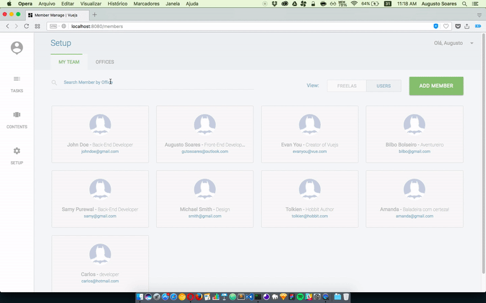

# Member \ Vue.js

> Simple CURD build in Vue.js Framework

## Demo


## Stack
* [Vue.js](vuejs.org)
* [Vue Resource](https://github.com/pagekit/vue-resource)
* [Vue Router](https://github.com/vuejs/vue-router)
* [Json Server](https://github.com/typicode/json-server)
* [Materialize](http://materializecss.com)

## Build Setup

``` bash
# install dependencies
npm install

# serve with hot reload at localhost:8080
npm run dev

# start json-server at localhost:3000
npm run server

# build for production with minification
npm run build
```

For detailed explanation on how things work, consult the [docs for vue-loader](http://vuejs.github.io/vue-loader).
